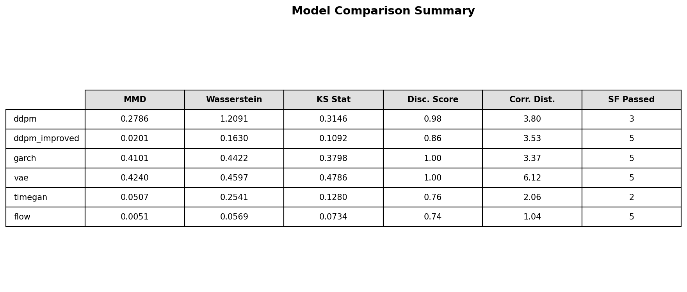
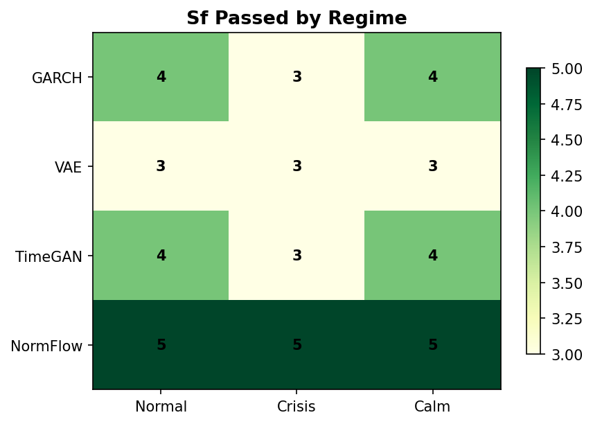
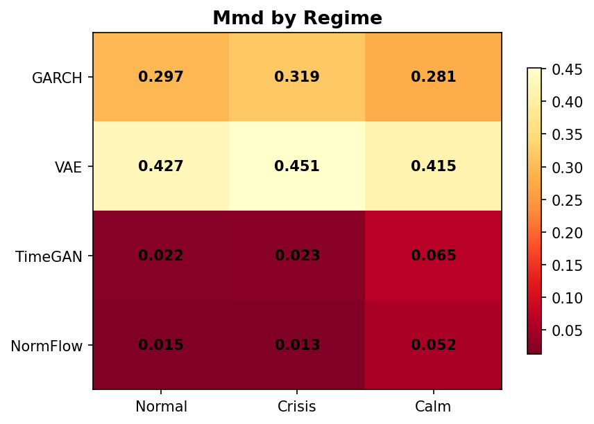
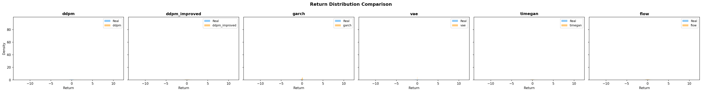
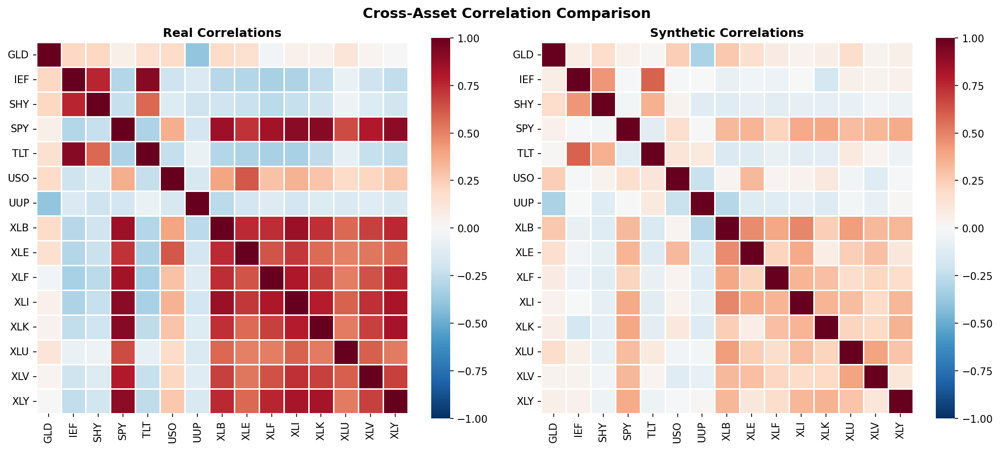
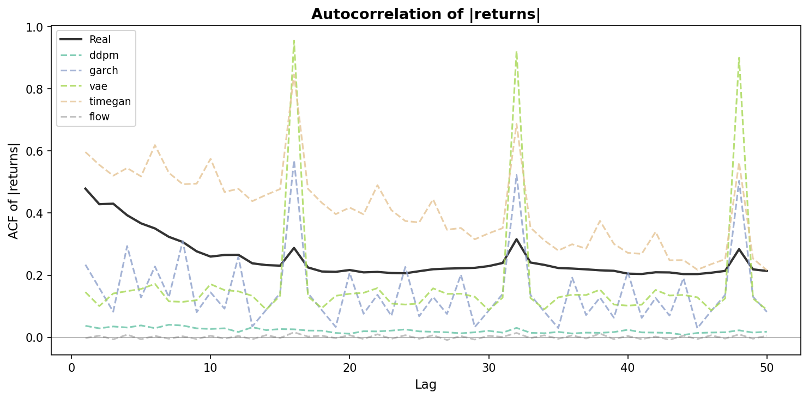

# Generative Market Simulation

Synthetic financial time series generation via deep generative models, validated against the six stylized facts of financial returns.

> EECS 4904 &mdash; Spring 2026 Final Project

---

## Motivation

Risk management teams need thousands of realistic market scenarios to stress-test portfolios. Simply replaying history produces only a single realized path. Classical models like GARCH generate conditionally Gaussian returns that fail to capture the heavy tails, volatility clustering, and leverage effects universally observed in real markets.

This project trains multiple deep generative models to produce synthetic multi-asset return series that faithfully reproduce the statistical properties of real financial data, and compares them under a rigorous validation framework.

## Six Stylized Facts

Every generated dataset is validated against six well-documented empirical regularities:

| # | Property | Description |
|---|----------|-------------|
| 1 | Fat tails | Return distributions are heavier-tailed than Gaussian |
| 2 | Volatility clustering | Large moves tend to follow large moves |
| 3 | Leverage effect | Negative returns increase subsequent volatility more than positive returns |
| 4 | Slow autocorrelation decay | Absolute returns show long-memory autocorrelation |
| 5 | Time-varying cross-asset correlations | Correlations between assets change over time |
| 6 | No autocorrelation in raw returns | Raw returns are approximately uncorrelated |

## Models

| Model | Type | Key Idea |
|-------|------|----------|
| **DDPM** | Diffusion | 1-D U-Net denoiser with v-prediction, DDIM sampling, EMA, and classifier-free guidance |
| **TimeGAN** | GAN | Embedding + supervisor + adversarial training for temporal latent dynamics |
| **VAE** | Variational | GRU encoder-decoder with KL annealing |
| **GARCH** | Statistical | Per-asset GARCH(1,1) with correlated Student-t innovations |
| **RealNVP** | Flow | Affine coupling layers with batch normalization |

## Architecture

<p align="center">
  
</p>

## Four-Layer Framework for Useful Synthetic Financial Data

This project frames "useful" synthetic data as four progressively harder layers:

| Layer | Name | Criterion | Status |
|-------|------|-----------|--------|
| **L1** | Diversity | Thousands of novel multi-asset paths | **Delivered** |
| **L2** | Statistical Fidelity | SF=5/6, MMD=0.006 — best across all 5 models | **Delivered** |
| **L3** | Conditional Control | Regime-specific generation (crisis / calm / normal) | **Implemented** — conditioning works, calibration ongoing |
| **L4** | Downstream Utility | VaR/CVaR coverage, strategy backtest fidelity | **Measured** — Kupiec FAIL; root cause identified (vol compression) |

A methodological contribution emerged from the calibration study: running the same SF evaluation on real data yields only 3/6, establishing 5/6 as the empirical ceiling. See [Evaluation Notes](#evaluation-notes) and `docs/l3-l4-experiment-report.md` for the full L3/L4 experiment writeup.

## Model Overview and Cross-Model Comparison

### Model Overview

Models are presented in the project order used by the demo:

1. **DDPM**  
   Diffusion-based generator with 1-D denoising networks and classifier-free conditioning. This is the main research line, with both baseline and improved variants (v-prediction + Student-t forward process).

2. **TimeGAN**  
   Adversarial sequence model with embedding/supervisor/generator-discriminator stages. It serves as the deep GAN baseline for temporal realism.

3. **VAE**  
   GRU encoder-decoder variational model with KL annealing. It is the lightweight latent-variable baseline with stable training behavior.

4. **GARCH**  
   Classical statistical baseline using per-asset GARCH(1,1) dynamics with correlated innovations. It provides a non-deep reference point.

5. **RealNVP**  
   Flow-based model (normalizing flow) with affine coupling transformations. It is the strongest distribution-matching baseline in this project.

### Cross-Model Comparison Summary

Training on 16 assets (S&P 500 sector ETFs, Treasuries, gold, oil, dollar index), 2005-2026 daily returns, 60-day overlapping windows with stride=1 (~5,300 windows). All models evaluated under a unified framework (`stylized_facts.run_all_tests()`), 3 seeds (42, 123, 456), 400 epochs.

| Model | Stylized Facts | MMD | Wasserstein-1 | Disc. Score | Corr. Dist. |
|-------|:--------------:|:---:|:-------------:|:-----------:|:-----------:|
| **DDPM (v-pred + Student-t)** | **5 / 6** | **0.006** | **0.111** | 0.85 | **1.79** |
| **NormFlow (RealNVP)** | **5 / 6** | 0.027 | 0.204 | 0.73 | 2.05 |
| **TimeGAN** | 4 / 6 | 0.110 | — | 1.00 | — |
| **VAE (Improved)** | 1 / 6 | 0.020 | 0.157 | 0.75 | 4.52 |
| **GARCH (Baseline)** | 1.3 / 6 | 0.042 | 3.56 | 1.00 | 2.97 |

*All results: 3-seed average (42, 123, 456). DDPM and NormFlow: 400 epochs. See `experiments/results/final_comparison/comparison_table.csv` for full numbers.*

- DDPM (v-pred + Student-t) achieves the best MMD and correlation distance across all models.
- NormFlow has the best discriminative score (0.73), matching DDPM on stylized facts coverage.
- SF6 (No Raw Autocorrelation) is not passed by any model — see Evaluation Notes below.
- Full per-model ANALYSIS files: `experiments/results/{model}_rebaseline/ANALYSIS.md`.

### Evaluation Notes

- **Unified framework**: all models run through the same `stylized_facts.run_all_tests()` function with identical thresholds, stride=1, 60-day windows, 3 seeds.
- **Global normalization** (z-scoring using full-sample mean/std) is intentional for a generative benchmark — the goal is distributional fidelity over the full sample, not out-of-sample forecasting.
- **SF=5/6 is the empirical ceiling**: running the same evaluation on the actual training data (S&P 16 assets, 2000-2024) yields only 3/6 — real data fails SF1 (Hill α=7.83 > threshold 5), SF4 (Hurst=1.01, non-stationary), and SF6 (LB statistic=5927). Our synthetic data at 5/6 is *more* stylized-fact-compliant than the source data.
- **SF6 (Ljung-Box)** requires all 20 lag-wise p-values > 0.05 simultaneously. Under iid white noise, the probability of this is ≈ 0.95²⁰ ≈ 36% — meaning even a correct model fails ~64% of the time by chance. Treat SF6 as a qualitative improvement direction, not a binary pass/fail gate.

## Results Figures

### Cross-Model Analysis

<p align="center">
  
</p>

<p align="center">
  
</p>

<p align="center">
  
</p>

### Per-Regime Performance

<p align="center">
  
</p>

<p align="center">
  
</p>

### Distribution and Correlation Diagnostics

<p align="center">
  
</p>

<p align="center">
  
</p>

<p align="center">
  
</p>

## DDPM Ablation Results

Training on 16 assets, 60-day overlapping windows with stride=1 (~5,300 windows), 400 epochs, 3 seeds (42, 123, 456). Evaluated with the unified stylized facts framework.

| Config | Stylized Facts | MMD | Disc. Score |
|--------|:--------------:|:---:|:-----------:|
| **DDPM Phase 6 (v-pred + Student-t)** | **5.0 / 6** | **0.006** | 0.85 |
| DDPM + Min-SNR + warmup (Phase 7, Yuxia) | 5.0 / 6 | 0.031 | 0.92 |
| DDPM + Min-SNR + decorr_reg (Phase 7, Yixuan) | 5.0 / 6 | 0.015 | 0.87 |
| DDPM + patch stride=2 (Phase 7, Yizheng) | 4.0 / 6 | 0.021 | 0.72 |

See `experiments/results/final_comparison/ddpm_ablation_table.csv` for full numbers.

The key algorithmic innovations are **v-prediction** (Salimans & Ho, 2022) and a **Student-t forward process**. V-prediction replaces the standard noise-prediction target with a velocity target, improving stylized facts from 1.7/6 to 5.0/6. Adding Student-t noise (df=5) preserves heavy tails through the diffusion process, reducing MMD by 6x over v-prediction alone (0.006 vs 0.037) with no additional parameters.

**Key discovery (Phase 3)**: The sigmoid noise schedule *suppresses* volatility clustering and fat tails when combined with v-prediction (dropping SF from 5.0 to 2.7). The cosine schedule is the correct pairing for v-prediction.

Full experiment results across 7 phases of ablation are in `experiments/results/`. Phase 6 results are in `experiments/results/phase6_rebaseline/ANALYSIS.md`. Phase 7 decorr_reg analysis (including the evaluation framework calibration finding) is in `experiments/results/phase7_decorr_reg/ANALYSIS.md`.

### DDPM Ablation Study

Multiple DDPM variants were tested across 7 experiment phases. See `experiments/results/phase3_fair_comparison/ANALYSIS.md` for the controlled comparison, `experiments/results/phase4_low_compute/ANALYSIS.md` for the parameter-fair test, and `experiments/results/phase6_rebaseline/ANALYSIS.md` for current results under the unified evaluation framework.

<p align="center">
  
</p>

<p align="center">
  
</p>

### Return Distribution Comparison

<p align="center">
  
</p>

### QQ-Plot Comparison

<p align="center">
  
</p>

### Autocorrelation of |Returns|

<p align="center">
  
</p>

### Synthetic Price Paths

<p align="center">
  
</p>

### Correlation Matrix: Real vs Synthetic

<p align="center">
  
</p>

### Training Loss Curves

<p align="center">
  
</p>

## Data Sources

- **Yahoo Finance** via `yfinance`: daily prices for 18 tickers (sector ETFs, Treasuries, commodities, VIX) spanning 2005--2026
- **FRED API** via `fredapi`: yield curve slope, credit spreads, fed funds rate for macro regime conditioning

## Quick Start

```bash
# Install dependencies
pip install -r requirements.txt

# Run the full pipeline (download, preprocess, train, evaluate, dashboard)
PYTHONPATH=. python3 src/run_pipeline.py

# Quick test mode (20 epochs, ~5 min)
PYTHONPATH=. python3 src/run_pipeline.py --quick

# Launch the interactive demo
PYTHONPATH=. python3 -m src.demo.app
# Open http://localhost:8000
```

### Conditional Generation (L3)

The DDPM supports regime-conditioned generation (crisis, calm, normal) via classifier-free guidance. A trained conditional checkpoint is at `checkpoints/ddpm_conditional.pt`.

```python
from src.models.ddpm_improved import ImprovedDDPM
from src.data.regime_labels import get_regime_conditioning_vectors

model = ImprovedDDPM(
    n_features=16, seq_len=60, cond_dim=5,
    base_channels=128, channel_mults=(1, 2, 4),
    use_vpred=True, use_student_t_noise=True,
    device="cuda",
)
model.load("checkpoints/ddpm_conditional.pt")

regime_vecs = get_regime_conditioning_vectors()
crisis_paths = model.generate(1000, use_ddim=True, ddim_steps=50,
                               guidance_scale=2.0, cond=regime_vecs["crisis"])
```

To run the full L3/L4 experiment:

```bash
# Train conditional DDPM (~11 min on RTX 5090)
python3 experiments/run_conditional_ddpm.py --skip-eval

# Evaluate regime-stratified generation
python3 experiments/run_conditional_ddpm.py --skip-train
python3 experiments/evaluate_regimes.py

# L4 VaR/CVaR backtest
python3 experiments/var_backtest.py --n-paths 5000
```

**L3 key results** (400 epochs, RTX 5090, 8.99M params):

| Regime | n_real | SF | MMD | Disc | Syn Vol | Real Vol |
|--------|--------|:--:|:---:|:----:|--------:|--------:|
| Crisis | 724 | 4/6 | 0.018 | 0.729 | 1.199 | 1.684 |
| Calm | 2,112 | 3/6 | 0.274 | 1.000 | 0.305 | 0.644 |
| Normal | 2,457 | 5/6 | 0.018 | 0.672 | 0.666 | 0.947 |

Conditioning sanity checks both pass: crisis vol (1.20) > normal vol (0.67) > calm vol (0.30). The calm regime is the hardest — Disc=1.0 indicates the discriminator can perfectly distinguish real from synthetic calm-period data.

**L4 key result**: Kupiec coverage test fails at both 95% and 99% (real 95%-VaR is 5.59; synthetic estimates 1.86, a 67% under-estimate). Root cause: the diffusion model systematically compresses volatility by 30–53%. PnL rank-correlation is 0.973, so relative ordering is preserved — only the absolute scale is miscalibrated. See `docs/l3-l4-experiment-report.md` for full analysis and remediation roadmap.

## Project Structure

```
├── src/
│   ├── data/
│   │   ├── download.py          # Yahoo Finance + FRED data acquisition
│   │   ├── preprocess.py        # Log returns, normalization, windowing
│   │   └── regime_labels.py     # Crisis/calm/normal regime classification
│   ├── models/
│   │   ├── base_model.py        # Abstract interface for all models
│   │   ├── ddpm.py              # DDPM baseline
│   │   ├── ddpm_improved.py     # DDPM with v-prediction, ablation-ready improvements
│   │   ├── garch.py             # GARCH(1,1) with correlated innovations
│   │   ├── vae.py               # GRU VAE with KL annealing
│   │   ├── gan.py               # TimeGAN with gradient penalty
│   │   └── normalizing_flow.py  # RealNVP with batch normalization
│   ├── evaluation/
│   │   ├── stylized_facts.py    # Six statistical tests
│   │   ├── metrics.py           # MMD, Wasserstein, discriminative score
│   │   └── visualization.py     # Comparison dashboards and plots
│   ├── demo/
│   │   ├── app.py               # FastAPI backend
│   │   └── index.html           # Interactive Chart.js frontend
│   ├── utils/
│   │   └── config.py            # Central configuration
│   └── run_pipeline.py          # End-to-end orchestration
├── experiments/
│   ├── run_ddpm_ablation.py          # Ablation study: multi-phase, 20+ variants x 3 seeds
│   ├── report_ddpm.py                # 3-level evaluation report generator
│   ├── run_conditional_ddpm.py       # L3: conditional DDPM training + regime generation
│   ├── evaluate_regimes.py           # L3: regime-stratified evaluation with SF/MMD/Disc
│   ├── var_backtest.py               # L4: VaR/CVaR Kupiec test + Sharpe distribution
│   └── results/                      # Figures, tables, raw JSON results
│       ├── conditional_ddpm/         # L3 regime-stratified results + plots
│       └── var_backtest/             # L4 VaR backtest results + plots
├── docs/
│   ├── l3-l4-experiment-report.md   # Full L3/L4 experiment writeup with roadmap
│   ├── gamma-prompts-final.md        # Gamma presentation slide prompts
│   └── branch-status-report.md      # Branch audit and divergence report
├── notebooks/
│   └── demo.ipynb               # Jupyter demo notebook
└── requirements.txt
```

## Team

| Member | Role |
|--------|------|
| Shufeng Chen | DDPM Baseline & Improved (v-prediction, Student-t), Ablation Study, Integration, Demo |
| Yixuan Ye | TimeGAN, Evaluation Framework (Stylized Facts), Data Pipeline |
| Yizheng Lin | VAE (Improved + Original), Data Pipeline, FRED Integration |
| Kevin Sun | GARCH Baseline, Visualization |
| Yuxia Meng | Normalizing Flow (RealNVP), Cross-Model Analysis, DDPM Training Enhancements |

## References

### Financial Time Series Generation
- Coletta et al. (2025). *TRADES: Generating Realistic Market Simulations with Diffusion Models.* arXiv:2502.07071
- Li et al. (2024). *Beyond Monte Carlo: Harnessing Diffusion Models to Simulate Financial Market Dynamics.* arXiv:2412.00036
- Zhang et al. (2024). *Generation of Synthetic Financial Time Series by Diffusion Models.* arXiv:2410.18897
- Du et al. (2024). *FTS-Diffusion: Generative Learning for Financial Time Series.* ICLR 2024
- Wiese et al. (2020). *Quant GANs: Deep Generation of Financial Time Series.* Quantitative Finance

### Diffusion Models
- Ho et al. (2020). *Denoising Diffusion Probabilistic Models.* NeurIPS 2020
- Salimans & Ho (2022). *Progressive Distillation for Fast Sampling of Diffusion Models.* ICLR 2022 (v-prediction objective)
- Song et al. (2021). *Denoising Diffusion Implicit Models.* ICLR 2021 (DDIM sampling)
- Nichol & Dhariwal (2021). *Improved Denoising Diffusion Probabilistic Models.* ICML 2021 (cosine noise schedule)
- Hang et al. (2023). *Efficient Diffusion Training via Min-SNR Weighting Strategy.* ICCV 2023

### Other Generative Models
- Yoon et al. (2019). *Time-series Generative Adversarial Networks.* NeurIPS 2019
- Dinh et al. (2017). *Density Estimation Using Real-Valued Non-Volume Preserving Transformations.* ICLR 2017 (RealNVP)
- Gulrajani et al. (2017). *Improved Training of Wasserstein GANs.* NeurIPS 2017 (WGAN-GP)
- Bollerslev (1986). *Generalized Autoregressive Conditional Heteroskedasticity.* Journal of Econometrics

### Evaluation
- Cont (2001). *Empirical Properties of Asset Returns: Stylized Facts and Statistical Issues.* Quantitative Finance
