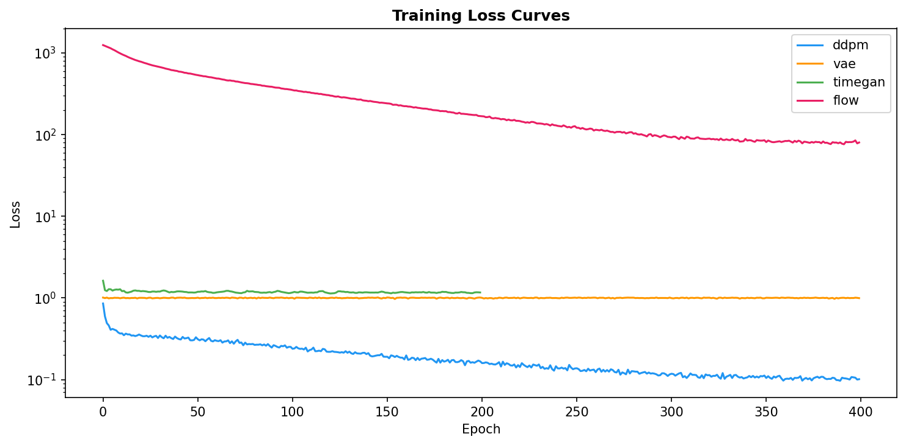

# Generative Market Simulation

Synthetic financial time series generation via deep generative models, validated against the six stylized facts of financial returns.

> EECS 4904 &mdash; Spring 2026 Final Project

---

## Motivation

Risk management teams need thousands of realistic market scenarios to stress-test portfolios. Simply replaying history produces only a single realized path. Classical models like GARCH generate conditionally Gaussian returns that fail to capture the heavy tails, volatility clustering, and leverage effects universally observed in real markets.

This project trains multiple deep generative models to produce synthetic multi-asset return series that faithfully reproduce the statistical properties of real financial data, and compares them under a rigorous validation framework.

## Six Stylized Facts

Every generated dataset is validated against six well-documented empirical regularities:

| # | Property | Description |
|---|----------|-------------|
| 1 | Fat tails | Return distributions are heavier-tailed than Gaussian |
| 2 | Volatility clustering | Large moves tend to follow large moves |
| 3 | Leverage effect | Negative returns increase subsequent volatility more than positive returns |
| 4 | Slow autocorrelation decay | Absolute returns show long-memory autocorrelation |
| 5 | Time-varying cross-asset correlations | Correlations between assets change over time |
| 6 | No autocorrelation in raw returns | Raw returns are approximately uncorrelated |

## Models

| Model | Type | Key Idea |
|-------|------|----------|
| **DDPM** | Diffusion | 1-D U-Net denoiser with DDIM sampling, EMA, and classifier-free guidance for conditional regime generation |
| **TimeGAN** | GAN | Embedding + supervisor + adversarial training for temporal latent dynamics |
| **VAE** | Variational | GRU encoder-decoder with KL annealing |
| **GARCH** | Statistical | Per-asset GARCH(1,1) with correlated Student-t innovations |
| **RealNVP** | Flow | Affine coupling layers with batch normalization |

## Architecture

```
Yahoo Finance + FRED API
        |
   download.py ──> preprocess.py ──> regime_labels.py
        |                |                  |
     prices.csv      windows.npy      window_cond.npy
                         |                  |
                   ┌─────┴──────────────────┘
                   v
        ┌──────────────────────┐
        │   5 Generative Models │
        │  DDPM | GAN | VAE    │
        │  GARCH | NormFlow    │
        └──────────┬───────────┘
                   v
        ┌──────────────────────┐
        │     Evaluation        │
        │  6 Stylized Facts     │
        │  MMD / Wasserstein    │
        │  Discriminative Score │
        └──────────┬───────────┘
                   v
        ┌──────────────────────┐
        │    Interactive Demo   │
        │  FastAPI + Chart.js   │
        └──────────────────────┘
```

## Results

Training on 15 assets (S&P 500 sector ETFs, Treasuries, gold, oil, dollar index), 2005-2026 daily returns, 60-day overlapping windows.

| Model | Stylized Facts | MMD | Discriminative Score |
|-------|:--------------:|:---:|:--------------------:|
| **DDPM** | 4 / 6 | 0.276 | 0.98 |
| GARCH | 4 / 6 | 0.416 | 1.00 |
| VAE | 1 / 6 | 0.403 | 1.00 |
| TimeGAN | 2 / 6 | 0.074 | 0.79 |
| **NormFlow** | **5 / 6** | **0.001** | **0.72** |

*Discriminative score: accuracy of a classifier distinguishing real from synthetic (0.5 = indistinguishable).*

### Stylized Facts Heatmap

<p align="center">
  
</p>

### Return Distribution Comparison

<p align="center">
  
</p>

### Training Loss Curves

<p align="center">
  
</p>

## Data Sources

- **Yahoo Finance** via `yfinance`: daily prices for 18 tickers (sector ETFs, Treasuries, commodities, VIX) spanning 2005--2026
- **FRED API** via `fredapi`: yield curve slope, credit spreads, fed funds rate for macro regime conditioning

## Quick Start

```bash
# Install dependencies
pip install -r requirements.txt

# Run the full pipeline (download, preprocess, train, evaluate, dashboard)
PYTHONPATH=. python3 src/run_pipeline.py

# Quick test mode (20 epochs, ~5 min)
PYTHONPATH=. python3 src/run_pipeline.py --quick

# Launch the interactive demo
PYTHONPATH=. python3 -m src.demo.app
# Open http://localhost:8000
```

### Conditional Generation

The DDPM supports regime-conditioned generation (crisis, calm, normal) via classifier-free guidance:

```python
from src.models.ddpm import DDPMModel
from src.data.regime_labels import get_regime_conditioning_vectors

model = DDPMModel(n_features=15, seq_len=60, cond_dim=5, device="mps")
model.load("checkpoints/ddpm.pt")

crisis_paths = model.generate(1000, cond=get_regime_conditioning_vectors()["crisis"])
```

## Project Structure

```
├── src/
│   ├── data/
│   │   ├── download.py          # Yahoo Finance + FRED data acquisition
│   │   ├── preprocess.py        # Log returns, normalization, windowing
│   │   └── regime_labels.py     # Crisis/calm/normal regime classification
│   ├── models/
│   │   ├── base_model.py        # Abstract interface for all models
│   │   ├── ddpm.py              # DDPM with EMA, DDIM, classifier-free guidance
│   │   ├── garch.py             # GARCH(1,1) with correlated innovations
│   │   ├── vae.py               # GRU VAE with KL annealing
│   │   ├── gan.py               # TimeGAN with gradient penalty
│   │   └── normalizing_flow.py  # RealNVP with batch normalization
│   ├── evaluation/
│   │   ├── stylized_facts.py    # Six statistical tests
│   │   ├── metrics.py           # MMD, Wasserstein, discriminative score
│   │   └── visualization.py     # Comparison dashboards and plots
│   ├── demo/
│   │   ├── app.py               # FastAPI backend
│   │   └── index.html           # Interactive Chart.js frontend
│   ├── utils/
│   │   └── config.py            # Central configuration
│   └── run_pipeline.py          # End-to-end orchestration
├── notebooks/
│   └── demo.ipynb               # Jupyter demo notebook
├── results/                     # Generated comparison plots
└── requirements.txt
```

## Team

| Member | Role |
|--------|------|
| Shufeng Chen | Lead, DDPM, Integration, Demo |
| Yixuan Ye | TimeGAN, Evaluation Framework |
| Yizheng Lin | VAE, Data Pipeline |
| Yihang Sun | GARCH Baseline, Visualization |
| Mr. Meng | Normalizing Flow, Proposal |

## References

- Coletta et al. (2025). *TRADES: Generating Realistic Market Simulations with Diffusion Models.* arXiv:2502.07071
- Li et al. (2024). *Beyond Monte Carlo: Harnessing Diffusion Models to Simulate Financial Market Dynamics.* arXiv:2412.00036
- Zhang et al. (2024). *Generation of Synthetic Financial Time Series by Diffusion Models.* arXiv:2410.18897
- Du et al. (2024). *FTS-Diffusion: Generative Learning for Financial Time Series.* ICLR 2024
- Wiese et al. (2020). *Quant GANs: Deep Generation of Financial Time Series.* Quantitative Finance
- Yoon et al. (2019). *Time-series Generative Adversarial Networks.* NeurIPS 2019
- Cont (2001). *Empirical Properties of Asset Returns: Stylized Facts and Statistical Issues.* Quantitative Finance
