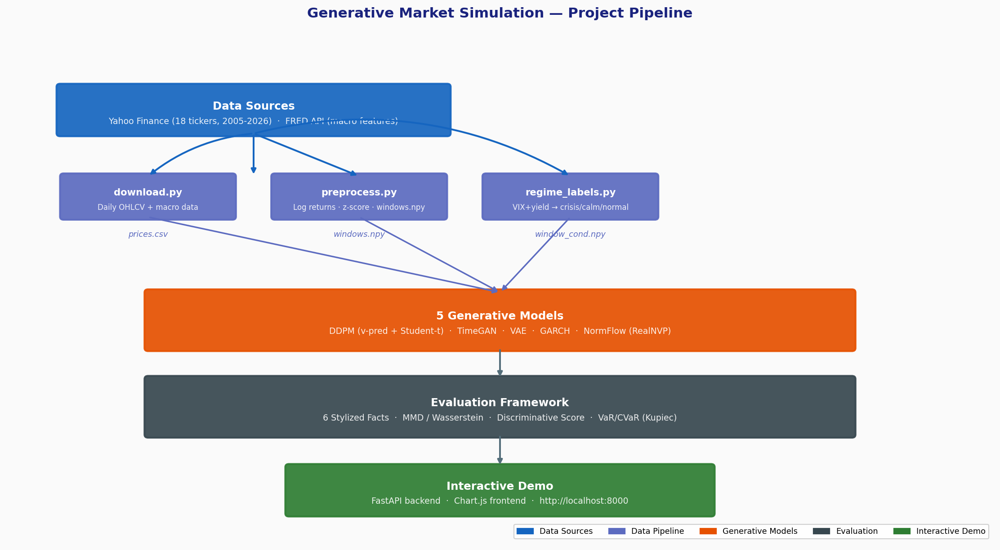
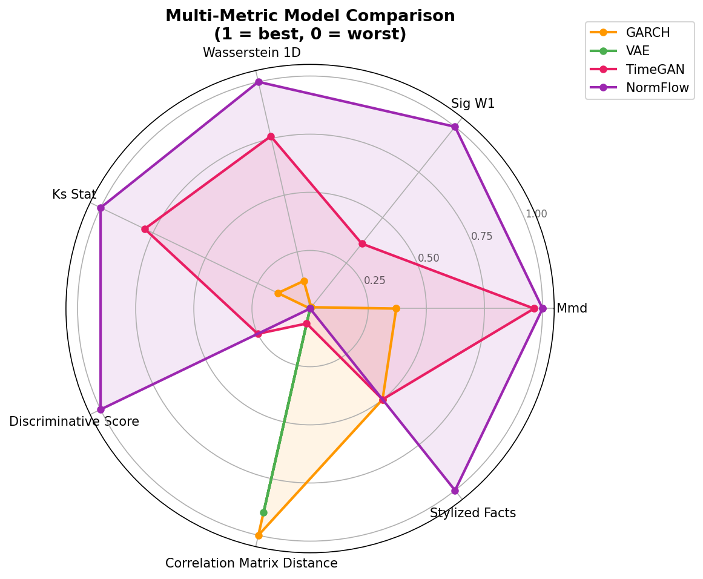
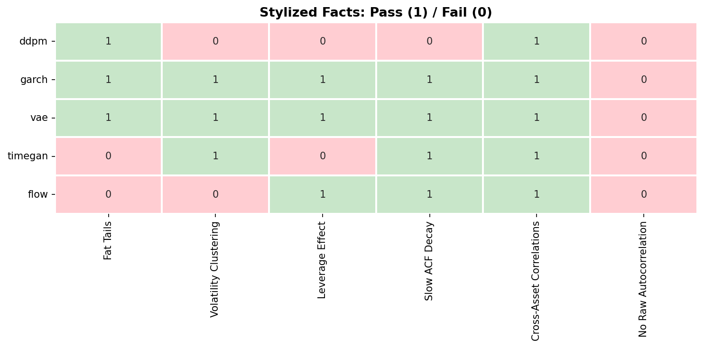

# Generative Market Simulation

Synthetic multi-asset financial time series via deep generative models.

> EECS 4904 &mdash; Spring 2026 Final Project

---

## Motivation

Risk managers need thousands of realistic market scenarios to stress-test portfolios — replaying a single historical path is not enough. We train multiple deep generative models to produce synthetic 60-day return windows that reproduce the statistical properties of real markets, and compare them under a unified validation framework.

## Stylized Facts

Generated data is validated against six empirical properties of real financial returns (Cont, 2001):

| # | Property | Description |
|---|----------|-------------|
| 1 | Fat tails | Return distributions are heavier-tailed than Gaussian |
| 2 | Volatility clustering | Large moves tend to follow large moves |
| 3 | Leverage effect | Negative returns amplify future volatility more than positive returns |
| 4 | Slow autocorrelation decay | Absolute returns show long-memory autocorrelation |
| 5 | Time-varying cross-asset correlations | Correlations between assets change over time |
| 6 | No autocorrelation in raw returns | Raw returns are approximately uncorrelated |

## Models

| Model | Type | Key Idea |
|-------|------|----------|
| **DDPM** | Diffusion | 1-D U-Net with v-prediction, Student-t forward process, DDIM sampling, classifier-free guidance |
| **TimeGAN** | GAN | Embedding + supervisor + adversarial training for temporal latent dynamics |
| **VAE** | Variational | GRU encoder-decoder with KL annealing |
| **GARCH** | Statistical | Per-asset GARCH(1,1) with correlated Student-t innovations |
| **RealNVP** | Flow | Affine coupling layers with batch normalization |

## Architecture

<p align="center">
  
</p>

## Layers

| Layer | Name | Criterion | Status |
|-------|------|-----------|--------|
| **L1** | Diversity | Thousands of novel multi-asset paths | Delivered |
| **L2** | Statistical Fidelity | SF=5/6, MMD=0.006 — best across all 5 models | Delivered |
| **L3** | Conditional Control | Regime-specific generation (crisis / calm / normal) on demand | Implemented |
| **L4** | Downstream Utility | VaR/CVaR Kupiec coverage test | Partial — 95% PASS, 99% open |

A calibration study finding: running the same SF evaluation on the real training data yields only 3/6. Our model at 5/6 is more statistically compliant than the data it trained on — establishing 5/6 as the empirical ceiling.

## Cross-Model Comparison

Training: 16 assets (S&P 500 sector ETFs, Treasuries, gold, oil, dollar index), 2005–2026 daily returns, 60-day windows stride=1 (~5,300 windows). All models: unified framework, 3 seeds (42, 123, 456), 400 epochs.

| Model | Stylized Facts | MMD | Wasserstein-1 | Disc. Score | Corr. Dist. |
|-------|:--------------:|:---:|:-------------:|:-----------:|:-----------:|
| **DDPM (v-pred + Student-t)** | **5 / 6** | **0.006** | **0.111** | 0.85 | **1.79** |
| **NormFlow (RealNVP)** | **5 / 6** | 0.027 | 0.204 | 0.73 | 2.05 |
| **TimeGAN** | 4 / 6 | 0.110 | — | 1.00 | — |
| **VAE (Improved)** | 1 / 6 | 0.020 | 0.157 | 0.75 | 4.52 |
| **GARCH (Baseline)** | 1.3 / 6 | 0.042 | 3.56 | 1.00 | 2.97 |

*3-seed average. See `experiments/results/final_comparison/comparison_table.csv` for full numbers.*

- DDPM achieves the best MMD and correlation distance.
- NormFlow has the best discriminative score (0.73), matching DDPM on SF.
- SF6 (no raw autocorrelation) is not passed by any model — see Evaluation Notes below.

### Evaluation Notes

- **Unified framework**: all models use the same `stylized_facts.run_all_tests()`, identical thresholds, stride=1, 60-day windows, 3 seeds.
- **Global normalization** (z-scoring over the full sample) is intentional for a generative benchmark — distributional fidelity over the whole sample, not out-of-sample forecasting.
- **SF=5/6 is the empirical ceiling**: real training data (S&P 16 assets, 2005–2026) scores only 3/6 — fails SF1 (Hill α=7.83), SF4 (Hurst=1.01, non-stationary), and SF6 (LB statistic driven by sample size). Our synthetic data at 5/6 is more stylized-fact-compliant than the source data.
- **SF6 (Ljung-Box)** requires all 20 lag-wise p-values > 0.05 simultaneously. Under i.i.d. white noise, the probability of this is ≈ 36%. Treat SF6 as a direction, not a binary gate.

## DDPM Ablation

| Config | Stylized Facts | MMD | Disc. Score |
|--------|:--------------:|:---:|:-----------:|
| **DDPM Phase 6 (v-pred + Student-t)** | **5.0 / 6** | **0.006** | 0.85 |
| DDPM + Min-SNR + warmup (Phase 7) | 5.0 / 6 | 0.031 | 0.92 |
| DDPM + Min-SNR + decorr_reg (Phase 7) | 5.0 / 6 | 0.015 | 0.87 |
| DDPM + patch stride=2 (Phase 7) | 4.0 / 6 | 0.021 | 0.72 |

Key innovations: **v-prediction** (Salimans & Ho, 2022) improved SF from 1.7/6 to 5.0/6. Adding **Student-t forward noise** (df=5) reduced MMD by 6× with no additional parameters.

Key discovery (Phase 3): sigmoid noise schedule suppresses fat tails when combined with v-prediction (SF drops from 5.0 to 2.7). Cosine schedule is the correct pairing.

## Results Figures

<p align="center">
  
</p>

<p align="center">
  
</p>

<p align="center">
  
</p>

<p align="center">
  
</p>

## Data Sources

- **Yahoo Finance** via `yfinance`: daily prices for 18 tickers (sector ETFs, Treasuries, commodities, VIX), 2005–2026
- **FRED API** via `fredapi`: yield curve slope, credit spreads, fed funds rate for macro regime conditioning

## Quick Start

```bash
pip install -r requirements.txt

# Full pipeline (download, preprocess, train, evaluate)
PYTHONPATH=. python3 src/run_pipeline.py

# Quick test (20 epochs, ~5 min)
PYTHONPATH=. python3 src/run_pipeline.py --quick

# Interactive demo
PYTHONPATH=. python3 -m src.demo.app
# Open http://localhost:8000
```

### Conditional Generation (L3)

```python
from src.models.ddpm_improved import ImprovedDDPM
from src.data.regime_labels import get_regime_conditioning_vectors

model = ImprovedDDPM(
    n_features=16, seq_len=60, cond_dim=5,
    base_channels=128, channel_mults=(1, 2, 4),
    use_vpred=True, use_student_t_noise=True,
    device="cuda",
)
model.load("checkpoints/ddpm_conditional.pt")

regime_vecs = get_regime_conditioning_vectors()
crisis_paths = model.generate(1000, use_ddim=True, ddim_steps=50,
                               guidance_scale=2.0, cond=regime_vecs["crisis"])
```

```bash
# Train conditional DDPM
python3 experiments/run_conditional_ddpm.py --skip-eval

# Evaluate regime-stratified generation
python3 experiments/run_conditional_ddpm.py --skip-train
python3 experiments/evaluate_regimes.py

# L4 VaR/CVaR backtest
python3 experiments/var_backtest.py --n-paths 5000
```

**L3 results** (expG_moderate, guidance_scale=1.0, 3-seed avg):

| Regime | n_real | SF | MMD | Disc | Syn Vol | Real Vol |
|--------|--------|:--:|:---:|:----:|--------:|--------:|
| Crisis | 724 | 4/6 | 0.018 | 0.814 | 1.257 | 1.684 |
| Calm | 2,112 | 3/6 | 0.374 | 1.000 | 0.335 | 0.644 |
| Normal | 2,457 | 4/6 | 0.027 | 0.782 | 0.561 | 0.947 |

Conditioning sanity: crisis vol (1.26) > normal vol (0.56) > calm vol (0.34). Direction is correct across all three regimes.

**L4 result** (expF_balanced + flat quantile mapping): 95% Kupiec PASS (p=0.069), VaR error 6.3%. PnL rank correlation = 0.988. The 99% level remains open — the model generates too few crisis-magnitude scenarios unconditionally for the 1% tail.

## Team

| Member | Role |
|--------|------|
| Shufeng Chen | DDPM Baseline and Improved (v-prediction, Student-t); 7-phase ablation; L3 Conditional DDPM; L4 VaR/CVaR Backtest; Cross-Model Pipeline |
| Yixuan Ye | TimeGAN; Evaluation Framework (Stylized Facts); Data Pipeline; Phase 7 Decorrelation Regularizer; SF Calibration Study; Presentation Review & 
Proposal Alignment |
| Yizheng Lin | VAE (Improved + Original); Data Pipeline; FRED Integration |
| Kevin Sun | GARCH Baseline; Visualization Utilities; Demo Interface Testing |
| Yuxia Meng | Normalizing Flow (RealNVP); Cross-Model Analysis; DDPM Training Enhancements (Min-SNR, warmup LR); Multi-Seed Validation |

## References

### Financial Time Series Generation
- Coletta et al. (2025). *TRADES: Generating Realistic Market Simulations with Diffusion Models.* arXiv:2502.07071
- Li et al. (2024). *Beyond Monte Carlo: Harnessing Diffusion Models to Simulate Financial Market Dynamics.* arXiv:2412.00036
- Zhang et al. (2024). *Generation of Synthetic Financial Time Series by Diffusion Models.* arXiv:2410.18897
- Du et al. (2024). *FTS-Diffusion: Generative Learning for Financial Time Series.* ICLR 2024
- Wiese et al. (2020). *Quant GANs: Deep Generation of Financial Time Series.* Quantitative Finance

### Diffusion Models
- Ho et al. (2020). *Denoising Diffusion Probabilistic Models.* NeurIPS 2020
- Salimans & Ho (2022). *Progressive Distillation for Fast Sampling of Diffusion Models.* ICLR 2022 (v-prediction objective)
- Song et al. (2021). *Denoising Diffusion Implicit Models.* ICLR 2021 (DDIM sampling)
- Nichol & Dhariwal (2021). *Improved Denoising Diffusion Probabilistic Models.* ICML 2021 (cosine noise schedule)
- Hang et al. (2023). *Efficient Diffusion Training via Min-SNR Weighting Strategy.* ICCV 2023

### Other Generative Models
- Yoon et al. (2019). *Time-series Generative Adversarial Networks.* NeurIPS 2019
- Dinh et al. (2017). *Density Estimation Using Real-Valued Non-Volume Preserving Transformations.* ICLR 2017 (RealNVP)
- Gulrajani et al. (2017). *Improved Training of Wasserstein GANs.* NeurIPS 2017 (WGAN-GP)
- Bollerslev (1986). *Generalized Autoregressive Conditional Heteroskedasticity.* Journal of Econometrics

### Evaluation
- Cont (2001). *Empirical Properties of Asset Returns: Stylized Facts and Statistical Issues.* Quantitative Finance
